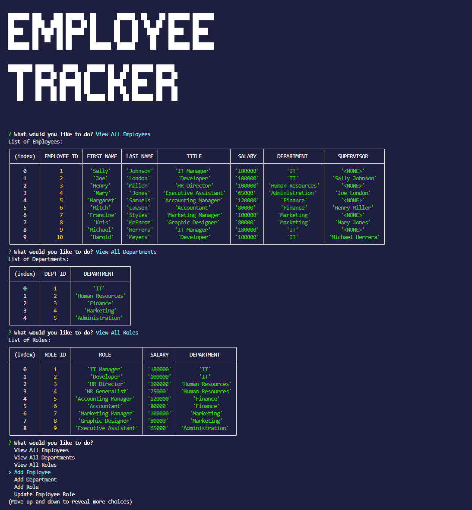

# Employee Tracker

## Description
The goal of the Employee-Tracker is to create an interface that allows a non-developer to easily view and interact with employee data in a content management system(CMS).  This is a command-line application built from scratch to manage a company's employee database.  This application demonstrates my knowledge of using JavaScript, Express, NodeJS, Inquirer, and MySQL.

## Credits

I thank folks in my EdX University of Minnesota Fullstack Bootcamp class for help and advice while building this challenging database: my instructor Gary Almes, and classmates Joe Preimesberger, Tyler Peterson, and Andrew Helmin, thank you guys!

### Specific Objectives
1. Create a command-line application that accepts user input.
2. Present the user with the following options: view all departments, view all roles, view all employees, add a department, add a role, add an employee, and update an employee role.
3. The view all departments choice displays a formatted table showing department names and department ids.
4. The view all roles choice displays a formatted table showing job title, role id, the department the role belongs to, and the salary for that role.
5. The view all employees choice displays a formatted table showing employee data, including employee ids, first names, last names, job titles, departments, salaries, and managers that the employees report to
6. The choice to add a department prompts the user to enter the name of the department and that department is added to the database and shows a confirmation statement.
7. The choice to add a role prompts the user to enter the name, salary, and department for the role and that role is added to the database and shows a confirmation statement.
8. The choice to add an employee prompts the user to enter the employee's first name, last name, role, and manager, and that employee is added to the database and shows a confirmation statement.
9. The choice to update and employee role prompts the user to select an employee and choose their new role, and that employee is updated in the database and a confirmation statement is shown.

## Installation
1. Clone the project
2. Build your .env file from the .envEXAMPLE
3. Open a terminal in the project folder
4. Run npm install
5. Open mysql and create and seed the table
6. Exit mysql and type "node index.js"

## Screenshot

## Walthrough Video
View on Screencastify: https://app.screencastify.com/v3/watch/F1ZUTCplPbfjzC5vGGU1

View on Google Drive: https://drive.google.com/file/d/1gHtq21iIU98RtRYC0abZhjfkNfAU5sNZ/view
